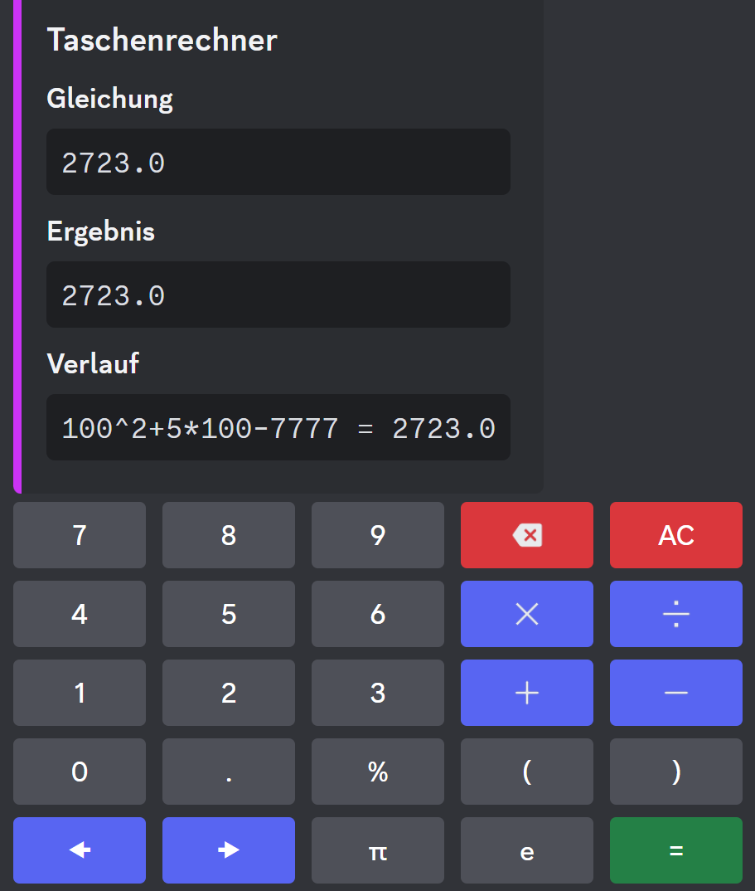

# v0.3.0

(Ja, für Version 0.2.0 gab es leider keinen Changelog :cry:)

## Mathe-Befehle

Wie man es schon aus früheren Tanjun-Versionen kennt, gibt es auch in dieser Version wieder Commands, mit denen man sich verschiedene Sachen berechnen lassen kann.

### `Calculator`-Befehl

Wir haben Tanjuns Taschenrechner-Command um ein Vielfaches verbessert und wir hoffen, dass er euch gefallen wird!

:eyes: Hier ein ganz kleiner Leak, wie der neue Taschenrechner-Command aussieht:

<figure><figcaption>
Gelöste Rechnung mit dem /math calculator Command.
</figcaption></figure>

### `Faculty`-Befehl

**Vielen Dank an** [**Alex**](https://github.com/aswa29) **für das Erstellen dieses Commands!** :heart:

Mit diesem Command kann man ganz simpel die Fakultät einer Zahl berechnen.

### `Randomnumber`-Befehl

Man kann einen [Rahmen von 2 Zahlen festlegen](#user-content-fn-1)[^1] und zwischen diesen beiden Zahlen wird einem dann eine zufällige Zahl generiert.

### `Calculate`-Befehl

Falls man einfach nur auf die Schnelle eine kleine Rechnung berechnen möchte und sich nicht durch den großen und umfangreichen Taschenrechner vom [#calculator-befehl](v0.3.0.md#calculator-befehl "mention") durchklicken möchte, kann man dafür diesen Befehl verwenden. :sunglasses:

### `Function`-Befehl

Mit diesem Command kann man Funktionen aufzeichnen, ableiten und integrieren. Hierdurch kann man jetzt (im weitesten Sinne) Analysen über Tanjun machen.

## Verbesserung des Warn-Systems

Wir haben das Warn-System stark verbessert! Jetzt kann man z.B. auch ein Mitglied automatisch in Timeout schicken, wenn jemand beispielsweise 2 Verwarnungen erhalten hat.

## Verbesserung der `Addrole`- und `Removerole`-Commands

Man hat jetzt optional die Möglichkeit, bis zu 25 Rollen an bis zu 25 Mitglieder auf einmal zu verteilen! Das sollte manche Situationen zukünftig wesentlich leichter machen.

## Möglichkeit zum Deaktivieren der Nachrichtenverfolgung

Auf Empfehlung von Discord kann man jetzt, wenn man das möchte, dafür sorgen, dass Tanjun alle Nachrichten von einem selbst ignoriert.

Weitere Informationen:


[opt-out.md](../docs/opt-out.md)


## Verschiedene Counting-Modi

Es gibt jetzt 3 verschiedene Counting-Modi in Tanjun.

1. Der bisher bekannte Modus, bei dem man unendlich hoch zählt und falsche Zahlen automatisch gelöscht werden.
2. Ein Modus, in dem man unendlich hoch zählen kann, man aber bei einer falschen Zahl wieder bei 1 anfängt.
3. Ein Modus, bei dem man eine bestimmte Zielzahl erreichen muss. Bei einer falschen Zahl fängt man wieder bei 1 an.

## Weiteres

* Das bekannte Spiel "Wortkette" gibt es jetzt auch in der neuen Tanjun-Version!
* Außerdem wurden ein paar kleinere Fehler in Funktionen [aus dem letzten Changelog](v0.1.0.md) behoben.

## Tanjun-Tester werden

Wir suchen aktuell ein paar Leute, welche die neue Tanjun-Version testen wollen würden. Für die Tests gibt es einen eigenen Bot, den ihr auf euren Server einladen könnt (alternativ könnt ihr auch auf unserem Testserver testen).&#x20;

**Wichtiger Hinweis:** Da der Bot noch in Bearbeitung ist und ein paar Bugs hat, könnte er _theoretisch_ euren Server beschädigen oder zerstören. Das sollte man im Hinterkopf behalten

Wenn ihr Tanjun-Tester werden wollt, dann kommt am besten [auf unseren Discord-Server](https://discord.arion2000.xyz) und schreibt [EntchenEric](https://discord.com/users/471036610561966111) eine DM[^2]. Wenn ihr uns bei der Entwicklung weiterhelfen könnt, schenken wir euch als Dankeschön einen 1-Jahr-Gutschein für das kommende Tanjun Pro-Abonnement.

> _Mehr zu Tanjun Pro wird im 1.0.0-Changelog erklärt, aber ihr könnt euch sicher sein, dass Tanjun auf keinen Fall Mee7 wird und definitiv nutzbar bleiben wird, auch wenn man Tanjun Pro nicht hat._ :thumbsup:

> _Ein genauer Release-Termin für Tanjun 1.0.0 steht noch nicht fest, aber Anfang August wirkt sehr realistisch._ :eyes:

[^1]: Von Discord wurde hierfür eine Untergrenze von -9007199254740991 und eine Obergrenze von 9007199254740991 festgelegt.\
    \
    Wir hoffen, dass das für die meisten Anwendungsfälle ausreicht. :)

[^2]: Direktnachricht
