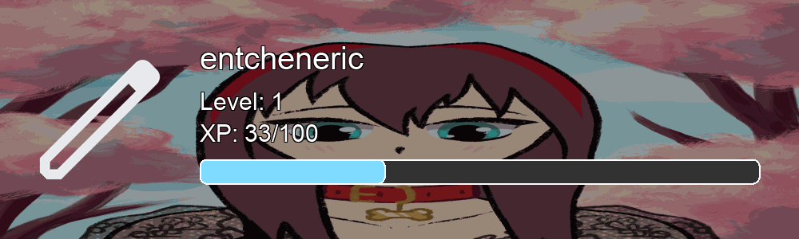
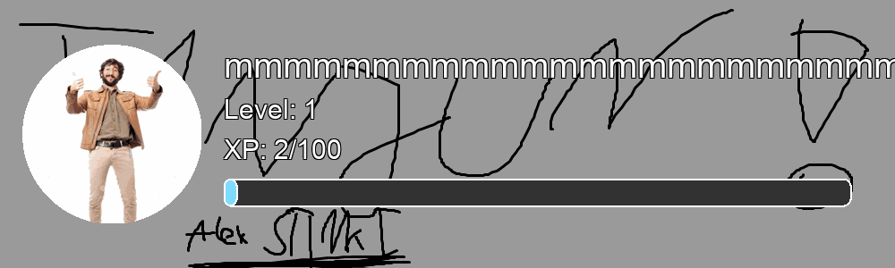
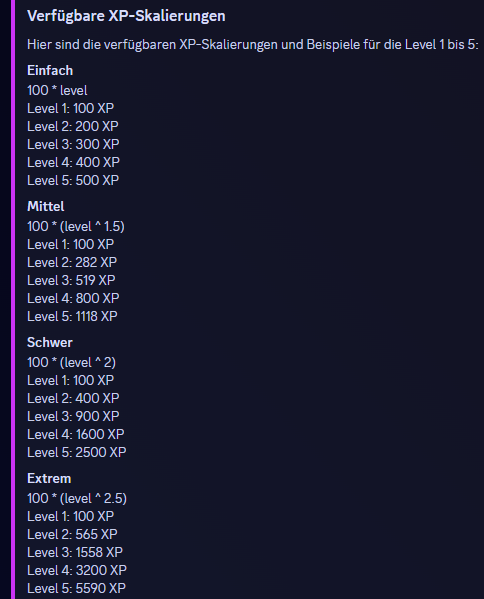

# 📅 v0.4.0

JA! Es ist zwar erst 2 Tage her, dass [v0.3.0](v0.3.0.md) fertig geworden ist, aber [EntchenEric](https://github.com/entcheneric) hat gekocht und nicht geschlafen. 

## Das Levelsystem

In dieser Tanjun Version findet ein neues Levelsystem in Tanjun Einzug - und dieses Mal sogar mit einer schönen Rankcard! :eyes: Hier zwei Bilder als Vorschau:

<figure><figcaption>
Animierte Profilbilder &#x26; Hintergründe werden unterstützt!
</figcaption></figure>

 

<figure><figcaption>
Vielleicht sind manche lange Namen irgendwann auch mal etwas zu lang :)
</figcaption></figure>

Folgende Befehle gibt es im neuen Levelsystem:

* `/level settings aktivieren` - Aktiviere das Levelsystem
* `/level settings deaktivieren` - Deaktiviere das Levelsystem\
  \-> Wenn das Levelsystem deaktiviert wird, werden **ALLE** Daten im Zusammenhang mit dem Levelsystem gelöscht
* `/level settings levelup_nachricht_aktivieren` - Aktiviere Levelup-Nachrichten
* `/level settings levelup_nachricht_deaktivieren` - Deaktiviere Levelup-Nachrichten\
  \-> Anders als beim Deaktivieren des Levelsystems wird beim Deaktivieren der Levelup-Nachrichten die personalisierte Levelup-Nachricht gespeichert
* `/level settings levelup_nachricht_ändern` - Die Levelup-Nachricht kann vollständig angepasst werden
* `/level settings xp_skalierung_ändern` - [Ändere die Schwierigkeit des Levelsystems](v0.4.0.md#schwierigkeit-des-levelsystems) 
* `/level settings level_rolle_hinzufügen` - Füge eine Levelrolle hinzu
* `/level settings level_rolle_entfernen` - Entferne eine Levelrolle
* `/level settings level_rollen_anzeigen` - Liste alle hinzugefügten Levelrollen auf
* `/level boosts anzeigen` - Liste allen aktiven XP-Boosts auf
* `/level boosts benutzer_hinzufügen` - Füge einen Boost für ein Mitglied hinzu
* `/level boosts benutzer_entfernen` - Entferne den Boost von einem Mitglied
* `/level boosts rolle_hinzufügen` - Füge einen Boost für alle Mitlieder, die eine bestimmte Rolle besitzen, hinzu
* `/level boosts rolle_entfernen` - Entferne den Boost für bestimmte Rollen
* `/level boosts kanal_hinzufügen` - Füge einen Boost für einem Kanal hinzu
* `/level boosts kanal_entfernen` - Entferne den Boost von einem Kanal
* `/level boosts berechnen` - Berechne, wie hoch der Boost ist, der ein Mitglied oder ein Kanal insgesamt hat
* `/level settings xp_vergeben` - Gib eine bestimmte Menge an XP an ein Mitglied
* `/level settings xp_entziehen` - Ziehe eine bestimmte Menge an XP von einem Mitglied ab

* Für das Schreiben von Nachrichten bekommt man 1-3 XP (zufällig), die dann mit den Boostern addiert bzw. multipliziert werden, wird evtl. später geändert, Feedback erwünscht.
* Wenn man (nicht alleine) [in einem Sprachkanal](#user-content-fn-1)[^1] ist, bekommt man zufällig zwischen 1-3 XP, die mit den Boostern addiert bzw. multipliziert werden.
* Des weiteren funktionieren alle anderen Funktionen, die mit den Befehlen verbunden sind (z. B. Levelrollen, Levelup-Nachrichten usw.).

### Schwierigkeit des Levelsystems

Die Schwierigkeit des Levelsystems sagt aus, wie sehr die XP-Anforderung von Level zu Level höher wird. Standardmäßig gibt es 4 Schwierigkeiten:

* Einfach: $$100 * Level$$
* Mittel: $$100 * Level^{1,5}$$
* Schwer: $$100 * Level^2$$
* Extrem: $$100 * Level^{2,5}$$

Falls ihr mit dem Formeln nichts anfangen könnt, kann der Bot auch automatisch die XP-Anforderung für Level berechnen.

<figure><figcaption></figcaption></figure>

Außerdem kann man eine **komplett** eigene Formel einfügen. - Das Levelsystem ist also individuell anpassbar, sodass es auf eurem Server einzigartig ist. :thumbsup:

## Tanjun-Tester

Seit dem letzten Changelog hat sich leider nur eine einzige Person als Tanjun-Tester beworben. 

[Auf unserem Discord-Server](https://discord.arion2000.xyz) könnt ihr deshalb [in diesem Kanal](https://discord.com/channels/831161440705839124/1256595757117472869/1256596540407943179) eine Umfrage ausfüllen und Feedback zum Tanjun-Tester Programm abgeben, falls ihr möchtet. 🥺

> _Ihr wollt gar nicht wissen, wie viel Arbeit das war, das Giveaway System und das Level System einzubauen._ 

[^1]: Der in den Servereinstellungen konfigurierte AFK-Kanal wird ignoriert.
