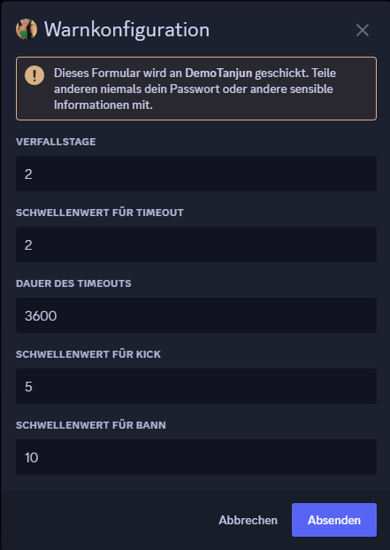

# Moderator-Befehle

## Grundfunktionen

Tanjun kann die grundlegenden Moderationsbefehle ausführen. Dazu gehören:

* `/admin kick <nutzer> [grund]`
* `/admin ban <nutzer> [grund]`
* `/admin unban <nutzer> [grund]`
* `/admin timeout <mitglied> <länge (in Minuten)> [grund]`
* `/admin timeout_aufheben <mitglied> [grund]`

## Warn-System 

Das Warn-System in Tanjun kann dazu verwendet werden, andere Mitglieder zu verwarnen, wenn sie gegen die Regeln verstoßen haben.

### `Config`-Befehl

Der `/admin warn konfigurieren`- Befehl kann verwendet werden, um das Warn-System zu konfigurieren. Hierbei wird sich ein Popup öffnen, in welchem das Warn-System konfiguriert werden kann.


Das Ändern der Verfallstage hat keinen Einfluss auf Verwarnungen in der Vergangenheit und wird nur auf zukünftige Verwarnungen angewendet werden.


Bedeutung der einzelnen Werte

* Die **Verfallstage** bestimmen, nach wie vielen Tagen eine Warnung automatisch verfallen soll.
* Der **Schwellwert für Timeout** bestimmt, nach wie vielen Warnungen ein Nutzer automatisch in Timeout geschickt wird. Der Nutzer wird für jede weitere Verwarnung über dem Schwellwert erneut in Timeout geschickt.
* Die **Dauer des Timeouts** bestimmt, wie lange der Nutzer in Timeout geschickt werden soll.
* Der **Schwellwert für Kick** gibt an, nach wie vielen Timeouts der Nutzer gekickt werden soll. Nach einem Kick kann der Nutzer jederzeit wieder auf den Server eingeladen werden. Wenn der **Schwellwert für Timeout** ≥ dem **Schwellwert für Kick** ist, wird der Nutzer auch in Timeout geschickt, welcher auch nach erneutem Betreten des Servers weiter abläuft. Für jede weitere Verwarnung wird der Nutzer erneut gekickt.
* Der **Schwellwert für Bann** gibt an, nach wie vielen Verwarnungen ein Nutzer gebannt werden soll.

<figure><figcaption>
Beispiel für das Popup zum Konfigurieren des Warn-Systems
</figcaption></figure>

### Jemanden verwarnen

Mit dem `/admin warn hinzufügen <mitglied> [grund]`-Befehl kann ein Nutzer verwarnt werden. Berechtigte Nutzer können nur Nutzer mit einer niedrigeren höchsten Rolle verwarnen als sie selbst. Wenn ein Nutzer verwarnt wird, bekommt dieser, [wenn möglich](#user-content-fn-1)[^1], eine DM[^2].

### Verwarnungen abrufen

Mit dem `/admin warn anzeigen <mitglied>`-Befehl können Verwarnungen von einzelnen Nutzern abgerufen werden.

Warnungen, können hier auch ganz einfach gelöscht werden. Beim Entfernen einer Verwarnung wird der verwarnte Nutzer **nicht** benachrichtigt (sowohl wenn sie abläuft als auch wenn sie manuell entfernt wird).

Wenn ein Nutzer über das Warn-System in Timeout geschickt, gekickt oder gebannt wird, wird dies als Grund in den Audit Logs in den Servereinstellungen angezeigt.

[^1]: Falls der verwarnte Nutzer den Bot z.B. blockiert hat oder generell keine Direktnachrichten akzeptiert, kann Tanjun diesem Nutzer keine Nachricht schreiben.

[^2]: Direktnachricht
