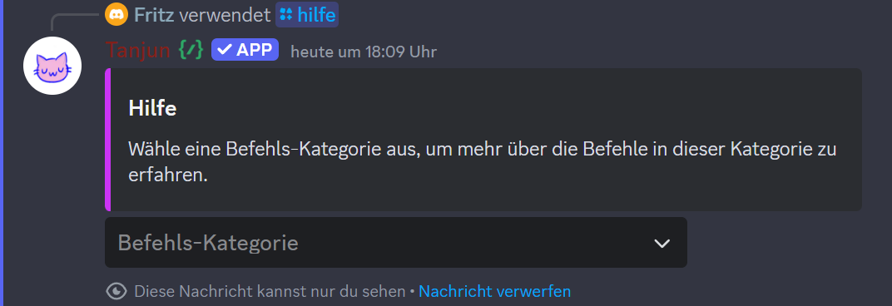
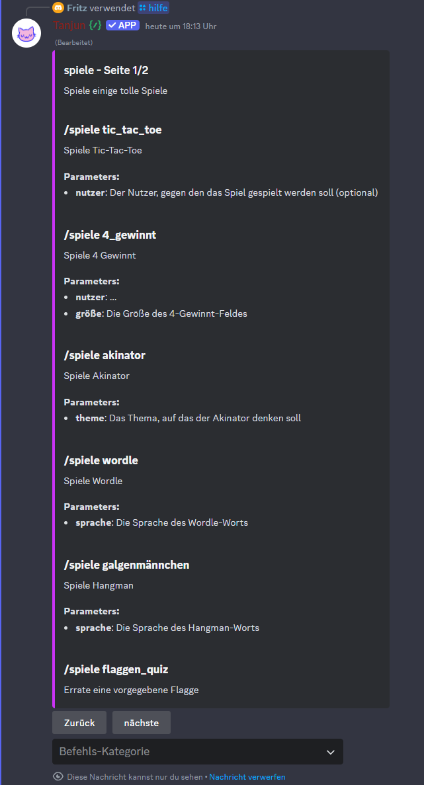

# Allgemeine Tipps

## Hilfe-Command <a href="#a1" id="a1"></a>

Wie die meisten Discord Bots hat auch Tanjun einen Hilfe-Command. Mit diesem kannst du dir alle aktuell verfügbaren Commands und deren Beschreibung anzeigen lassen.

Du kannst die Hilfe wie folgt aufrufen:&#x20;

```
/hilfe
```

Es wird dir eine Nachricht angezeigt, unter der du in einem Menü aus verschiedenen Kategorien auswählen kannst.

<figure><figcaption><p>Der Hilfe-Command zeigt ein aufklappbares Menü an, aus dem man Befehls-Kategorien auswählen kann.</p></figcaption></figure>

Wenn du eine Kategorie auswählst, werden dir alle Commands dieser Kategorie plus einer Beschreibung angezeigt.

<div data-full-width="false"><figure><figcaption><p>Die Spiele-Kategorie im Hilfe-Command zeigt alle Befehle inklusive Beschreibungen an.</p></figcaption></figure></div>

***

## Commandgruppen <a href="#a2" id="a2"></a>

Tanjun arbeitet in der neuesten Version mit Commandgruppen. Das kann in Kombination mit Discords Slash-Command-Menü dabei helfen, bestimmte Commands schneller zu finden, indem man nach einer bestimmten Kategorie sucht.


Die Kategorien in den Slash-Commands und im [#a1](index.md#a1 "mention") sind die gleichen. Wenn man z.B. einen Fun-Command senden will, gibt man einfach `/fun` ein und es werden die passenden Commands direkt vorgeschlagen.


Die Commands sind meistens wie folgt aufgebaut:

```
/<Command-Kategorie> <Subcommand> [Argument]
```

***

## Fehler melden & Ideen einbringen <a href="#a3" id="a3"></a>

#### Fehler melden: <a href="#a3.1" id="a3.1"></a>

Mithilfe des `/bugreport` Commands kannst du ein gefundenes Problem bzw. einen Bug reporten, um uns als Entwickler darüber zu informieren.&#x20;

#### Ideen/Feedback teilen: <a href="#a3.2" id="a3.2"></a>

Mit dem `/verschiedenes feedback` Command kannst du dein Feedback zu Tanjun an uns senden. Wir würden uns freuen, wenn du in deinem Feedback freundlich bleibst und uns konstruktive Kritik zusendest. Ideen und Vorschläge sind immer gerne gesehen! Dadurch können wir den Bot immer weiter verbessern!


**Achtung:** Solltest du diese Commands missbrauchen oder damit Spam absenden, werden wir dir die Möglichkeit entfernen, diese Commands verwenden zu können.


***

## Hinweise zur Angabe von Commands <a href="#a4" id="a4"></a>

Wenn wir in dieser Dokumentation Commands angeben, dann sind oft Elemente enthalten, die du durch etwas ersetzen musst. We specify these cases as follows:

<pre><code><strong>/commandname <Required argument> [Optional argument]
</strong></code></pre>

Die Zeichen `<`, `>`, `[` und `]` weisen wie im Beispiel auf erforderliche und optionale Argumente hin, die du an dieser Stelle selbst einsetzen musst.&#x20;
