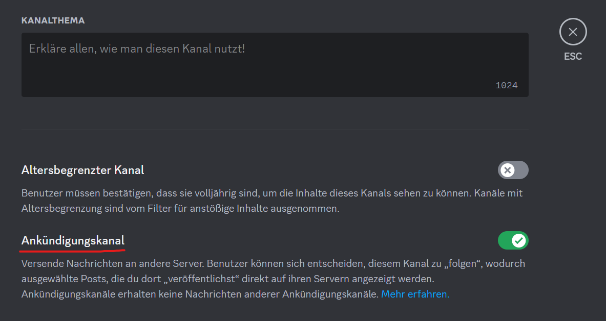

# Autopublish-Befehle

## `Autopublish`-Befehl

Mit dem `/verschiedenes autopublish autopublish [kanal]`-Befehl kannst du einen Kanal als Autopublish-Kanal festlegen. Nachrichten, welche in diesen Kanal gesendet werden, werden dann automatisch veröffentlicht.


Dies funktioniert nur in sogenannten **Ankündigungskanälen**. Um Ankündigungskanäle verwenden zu können, muss dein Server ein [Community-Server](https://support.discord.com/hc/de/articles/360047132851-Richte-deinen-Community-Server-ein#h_01H1W33CQVZCSKQGX9BM602RPP) sein.

Um einen Kanal zum Ankündigungskanal zu machen, musst du folgendes tun:

1. Öffne die Kanaleinstellungen

2. Scrolle nach unten bis zur Option für Ankündigungskanäle und aktiviere diese

3. Speichere die Änderungen
  

## `Entfernen`-Befehl

Mit dem `/verschiedenes autopublish entfernen [kanal]`-Befehl kannst du dafür sorgen, dass die Nachrichten in einem Kanal nicht mehr automatisch veröffentlicht werden.
