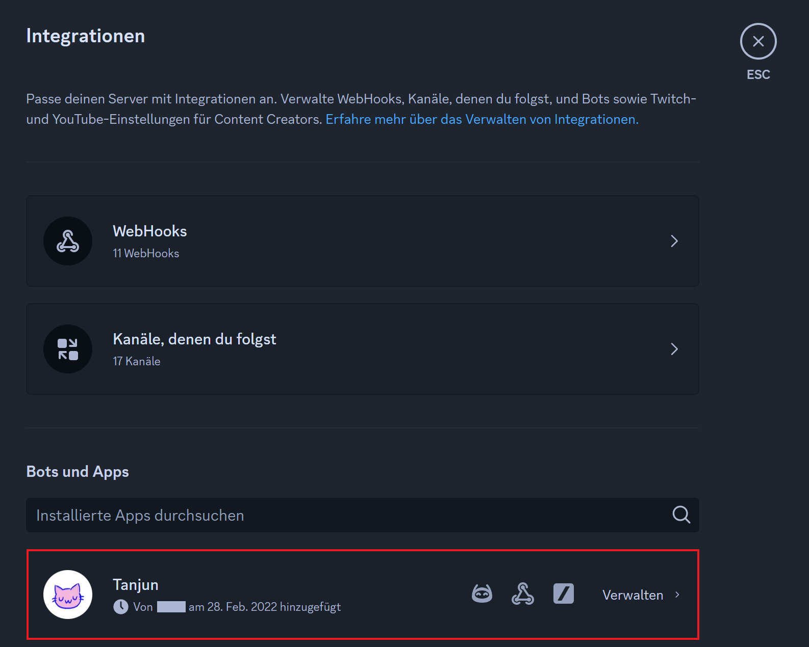
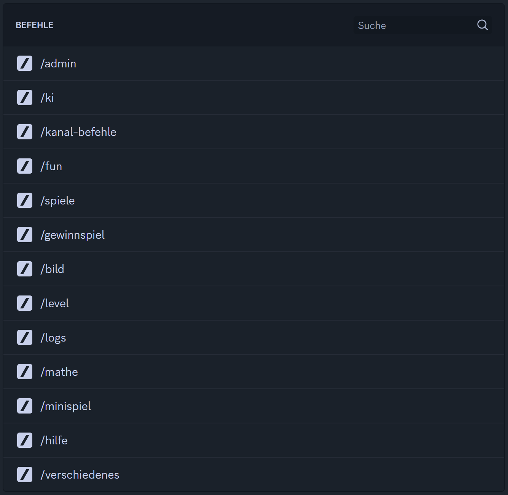
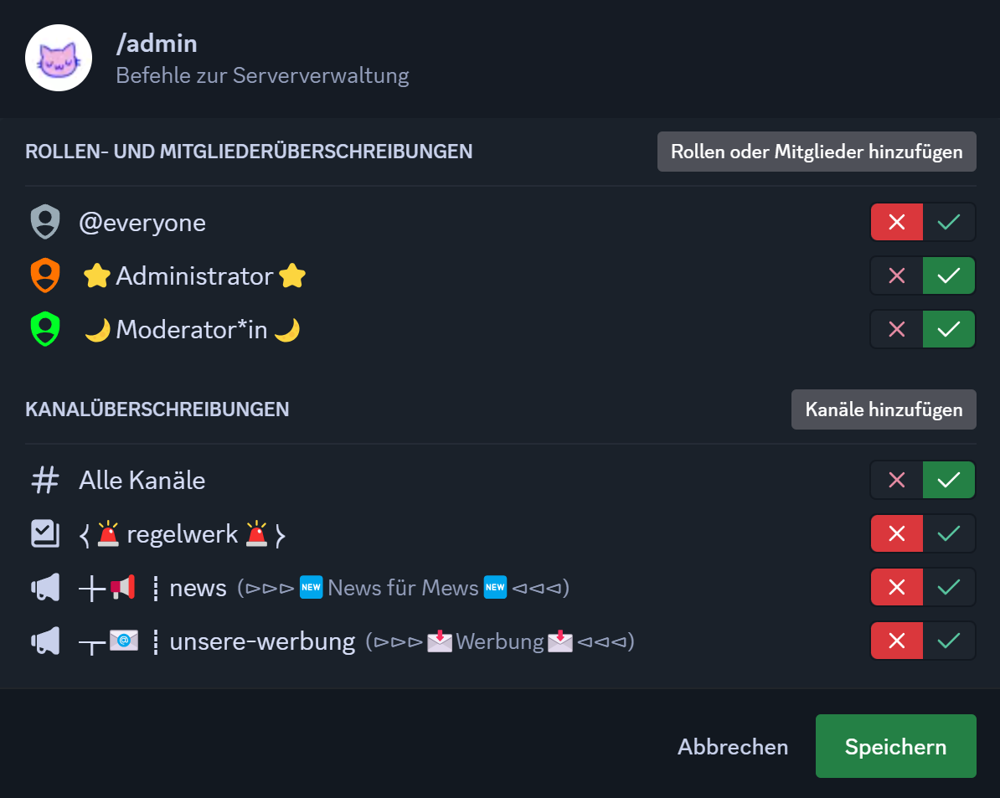

# Permissions

Erforderliche Berechtigungen

Damit Tanjun korrekt funktioniert, braucht dieser folgende Berechtigungen:

| Berechtigung                  | Zweck                                                                                                                                                                          |
| ----------------------------- | ------------------------------------------------------------------------------------------------------------------------------------------------------------------------------ |
| Server verwalten              | Für den `/admin sprache_setzen`-Befehl                                                                                                                                         |
| Rollen verwalten              | Für die Rollen in Admin-Befehlen und Booster-Rollen                                                                                                                            |
| Kanäle verwalten              | Für die Boosterkanäle und das Join-To-Create-System                                                                                                                            |
| Mitglieder kicken             | Für die Moderator-Befehle                                                                                                                                                      |
| Mitglieder bannen             | Für die Moderator-Befehle                                                                                                                                                      |
| Nicknames verwalten           | Für den Nickname-Befehl                                                                                                                                                        |
| Ausdrücke verwalten           | Für Funktionen, die u.U. Emojis, Sticker oder Sounds zum Server hinzufügen                                                                                                     |
| Ausdrücke erstellen           | Für den `/admin emoji_kopieren`-Befehl und andere Funktionen, die u.U. Emojis, Sticker oder Sounds zum Server hinzufügen                                                       |
| Audit-Log einsehen            | Um zusätzliche Informationen für die integrierten Logs zu sammeln und um eigene Begründungen, die beim Ausführen von Befehlen angegeben werden können, im Audit-Log anzuzeigen |
| Kanäle ansehen                | Damit Nutzer vollständig mit der App interagieren können                                                                                                                       |
| Mitglieder moderieren         | Für die Moderator-Befehle                                                                                                                                                      |
| Nahrichten senden             | Damit Tanjun auf Befehle antworten und Informationen an Nutzer senden kann                                                                                                     |
| Nachrichten in Threads senden | Um zu verhindern, dass Tanjun nicht antworten kann, wenn jemand in einem Thread eine Funktion der App nutzen möchte                                                            |
| Private Threads erstellen     | Um im Ticket-System Threads als Ticketkanäle erstellen zu können                                                                                                               |
| Nachrichten verwalten         | Um Nachrichten zu löschen, z.B. für Counting, Wortkette, usw.                                                                                                                  |
| Threads verwalten             | Um Tickets zu schließen                                                                                                                                                        |
| Links einbetten               | Damit Tanjun Embeds senden kann                                                                                                                                                |
| Dateien anhängen              | Um Bilder an Nachrichten anzuhängen (z.B. Rank-Cards, Willkommens-/Verabschiedungsnachrichten)                                                                                 |
| Nachrichtenverlauf anzeigen   | Um Ticketzusammenfassungen zu erstellen und, damit das Wortkette-Minigame funktioniert                                                                                         |
| Reaktionen hinzufügen         | Damit Tanjun auch ohne das Versenden von Nachrichten auf Nutzerinteraktionen und Befehle reagieren kann                                                                        |
| Externe Emojis verwenden      | Um Nachrichten schöner gestalten zu können                                                                                                                                     |
| Mitglieder verschieben        | Für Join-To-Create-System                                                                                                                                                      |


Um mögliche Problem mit fehlenden Berechtigungen zu verhindern oder zu beheben, kannst du Tanjun auch die `Administrator`-Berechtigung geben, um ihm vollen Zugriff auf den Server zu gewähren. Dies ist aber nicht zwingend erforderlich.


***

## Nutzerzugriff auf Befehle beschränken

In den allermeisten Fällen ist Tanjun schon so konfiguriert, dass man bestimmte Befehle nur mit den nötigen Berechtigungen ausführen kann. Zum Beispiel kann man der `/admin kick`-Befehl nur von Nutzern ausgeführt werden, die auf dem Server die Berechtigung `Mitglieder kicken` haben.

Wenn du aber benutzerdefinierte Berechtigungen für bestimmte Befehle festlegen möchtest, kannst du dies wie folgt tun:


Aufgrund von aktuellen Beschränkungen seitens Discord kann man die Berechtigungen nur für komplette Befehlsgruppen verändern. Auch wenn wir das sehr schade finden, liegt es leider nicht in unserer Macht, daran etwas zu ändern.


1. Öffne die **Servereinstellungen**
2. Wechsle zur Seite **Integrationen**
3. Wähle aus der Liste **Tanjun** aus

<figure><figcaption></figcaption></figure>

4. Wähle eine der verfügbaren Kategorien aus

<figure><figcaption></figcaption></figure>

5. Hier kannst du Rollen und Mitgliedern die Verwendung dieser Befehlsgruppe entweder erlauben oder verbieten. Außerdem kannst du die Funktionalität auf bestimmte Kanäle begrenzen.

<figure><figcaption></figcaption></figure>

6. Klicke auf Speichern, um die Änderungen zu übernehmen
