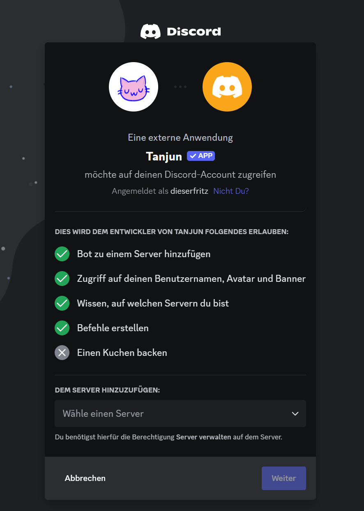
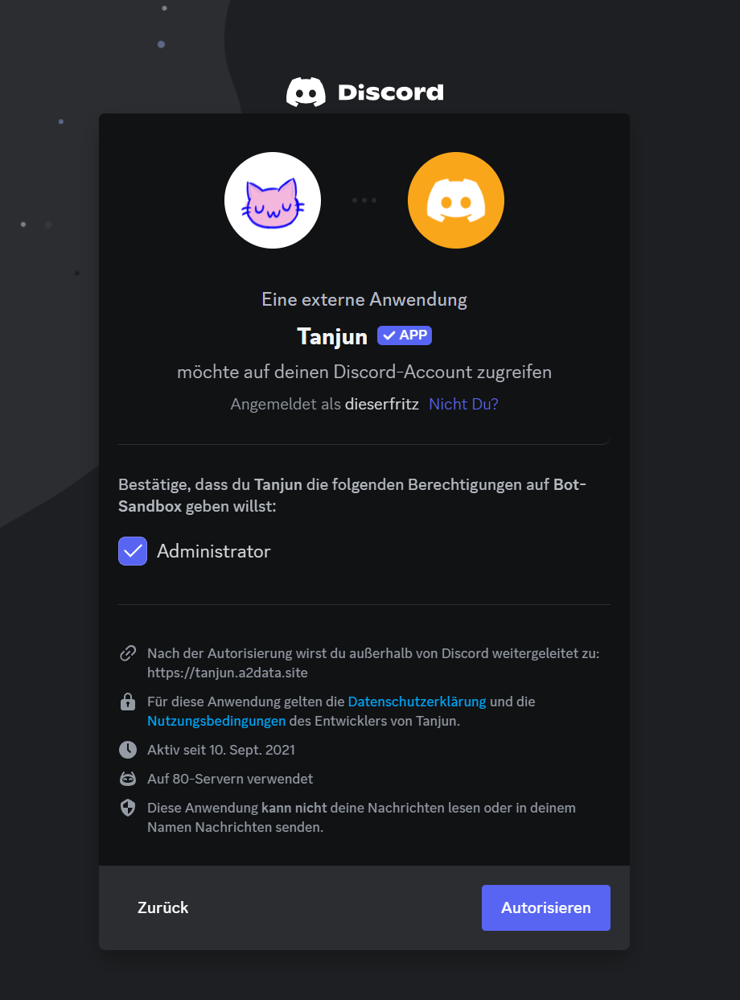

# Erste Schritte

## Tanjun auf einen Server einladen


Um Tanjun auf einen Server einzuladen, musst du auf dem Server die `Server verwalten`-Berechtigung besitzen.


Du kannst [diesen Link](https://go.tanjun.bot/invite) verwenden, um Tanjun einzuladen. Dir wird eine Seite von Discord angezeigt, auf der zu auswählen kannst, zu welchem Server du den Bot hinzufügen möchtest.

<figure><figcaption></figcaption></figure>

Klicke anschließend auf "Weiter". Auf der nächsten Seite siehst du eine Übersicht über die Berechtigungen, die der Tanjun auf dem Server benötigt, um vollständig zu funktionieren.

<figure><figcaption></figcaption></figure>

Klicke anschließend auf "Autorisieren".\
**Herzlichen Glückwunsch!** **Der Bot sollte sich nun auf deinem Server befinden.** :tada:

## Slash-Commands

Du kannst Slash-Commands verwenden, indem du `/` in das Nachrichtenfeld eingibst. Dir werden dann alle verfügbaren Bot-Commands angezeigt und du kannst einen auswählen.
